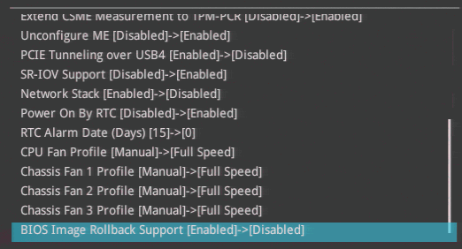
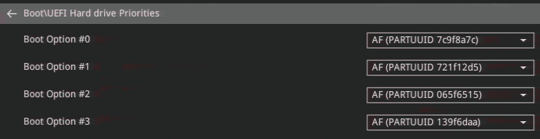

# Firmware Configuration

Hetzner provided an ASUS W680/MB DC motherboard running firmware version 2.21.1278. The following settings were changed from the 'optimized' defaults:

## Boot Order

With the help of efibootmgr, the boot order was configured for fault tolerance:

